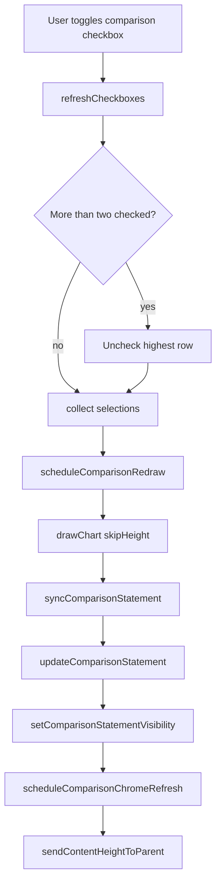
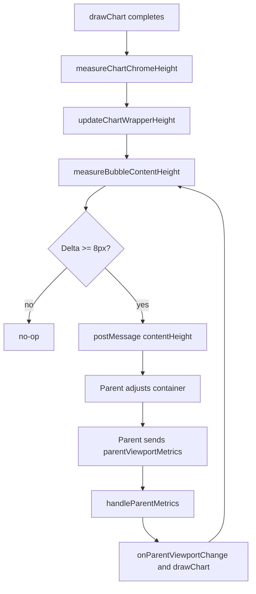

# Comparison Cards & Parent Height Negotiation

This note explains how the comparison cards ("c-cards") switch between active and inactive states, how the embedded experience negotiates height with its parent, and why the bubble chart often renders twice after each comparison change.

## c-card activation lifecycle

1. **Checkbox instrumentation** – When category rows are rebuilt, `refreshButtons()` injects a `label.comparison-checkbox-wrap` per row once at least two categories exist. It restores previous state, applies URL-provided `initialComparisonFlags`, and defaults the first two rows to checked status. See [bubblechart/main.js#L2142-L2230](bubblechart/main.js#L2142-L2230).
2. **Two-check maximum** – `refreshCheckboxes()` enforces that only two `.comparison-checkbox` inputs can be checked simultaneously. Extra checks are cleared from the highest (top-most) checked row in DOM order while keeping the user-triggered box sticky. Whenever a user change occurs, it schedules `scheduleComparisonRedraw('comparison-checkbox')` so the data/state stay in sync. Even if two inputs are auto-checked, c-cards remain hidden until both checked rows resolve to real categories with data. See [bubblechart/main.js#L2242-L2310](bubblechart/main.js#L2242-L2310).
3. **Selection harvest** – `getComparisonSelections()` walks the category rows, pairing the checked inputs with each row’s `<select>` value to produce up to two display names. See [bubblechart/main.js#L2312-L2331](bubblechart/main.js#L2312-L2331).
4. **Statement sync** – Every `drawChart()` call invokes `syncComparisonStatement()` before rendering. It maps the two selected names back to Supabase category records, enriches each record with scatter data (pollution, activity, emission factor), and derives:
   - `leftLeader`/`leftFollower` for emissions,
   - `energyLeader`/`energyFollower` for activity,
   - ratios, warning calculations, and tooltip payloads.
  If fewer than two selections or datapoints exist, it calls `hideComparisonStatement()` so placeholder defaults never surface as cards. See [bubblechart/main.js#L2334-L2700](bubblechart/main.js#L2334-L2700).
5. **Rendering & measurement** – `updateComparisonStatement()` builds the two c-card DOM blocks plus the warning ribbon, injects detailed tooltips, and writes the markup to `#comparisonDiv`. Before committing the markup it calls `updateComparisonMeasurement()` to render the same HTML inside an off-screen measuring div so it knows exactly how many pixels of “chrome” the cards will require. See [bubblechart/main.js#L3100-L3530](bubblechart/main.js#L3100-L3530) and the measurement helpers at [bubblechart/main.js#L472-L566](bubblechart/main.js#L472-L566).
6. **Visibility toggles** – When markup is added the code calls `setComparisonStatementVisibility(true, …)` to flip the `comparisonStatementVisible` flag, mark `pendingComparisonChromeHeight`, suppress the wrapper observer for 450 ms, and queue a chrome refresh via `scheduleComparisonChromeRefresh()`. If prerequisites fail later on, `hideComparisonStatement()` reverses those steps and zeroes the cached measurement so the parent can shrink again. The chrome refresh now ends by invoking `ChartRenderer.refreshLayoutBounds()` so the wrapper gets reclamped without forcing a second Google Charts draw. See [bubblechart/main.js#L3128-L3212](bubblechart/main.js#L3128-L3212), [bubblechart/main.js#L3532-L3558](bubblechart/main.js#L3532-L3558), and [bubblechart/chart-renderer.js#L959-L1001](bubblechart/chart-renderer.js#L959-L1001).

## Parent height negotiation pipeline

1. **Bootstrap** – The iframe instantiates `LayoutHeightManager.create({ namespace: 'bubble', … })` so it can estimate the minimum chart canvas size, clamp `.chart-wrapper` heights, and respond to parent metrics. See [bubblechart/main.js#L101-L139](bubblechart/main.js#L101-L139) and [SharedResources/layout-height-manager.js#L1-L220](SharedResources/layout-height-manager.js#L1-L220).
2. **Consuming parent metrics** – The iframe listens for `message` events of type `parentViewportMetrics`, pushes them through `layoutHeightManager.handleParentMetrics()`, and updates CSS custom properties (`--bubble-footer-height`, `--bubble-viewport-height`) so it mirrors the available space inside the parent shell. See [bubblechart/main.js#L205-L320](bubblechart/main.js#L205-L320).
3. **Chrome estimation** – Every draw (or parent resize) calls `measureChartChromeHeight()`, which sums the title, legend, and current comparison card height. If the new cards are still rendering, `pendingComparisonChromeHeight` uses the off-screen measurement as a prediction. See [bubblechart/main.js#L520-L566](bubblechart/main.js#L520-L566).
4. **Wrapper sizing** – `updateChartWrapperHeight()` hands the viewport height, footer reserve, and chrome buffer to `layoutHeightManager.estimateChartHeight()` so `.chart-wrapper` is clamped to at least 420 px and there is breathing room above the footer. The result is cached in `window.__BUBBLE_PRE_LEGEND_ESTIMATE`. See [bubblechart/main.js#L566-L640](bubblechart/main.js#L566-L640) and [SharedResources/layout-height-manager.js#L51-L160](SharedResources/layout-height-manager.js#L51-L160).
5. **Document measurement** – After each render `measureBubbleContentHeight()` samples multiple DOM bottoms (shell, mainContent, wrapper, tutorial overlay) and falls back to the document height to decide how tall the iframe truly is. This guards against CSS transitions and overlays that temporarily extend the page. See [bubblechart/main.js#L1504-L1606](bubblechart/main.js#L1504-L1606).
6. **Parent notification loop** – `sendContentHeightToParent()` posts `{ type: 'contentHeight', chart: 'bubble', height }` when the measured value changes by ≥ 8 px. The parent reacts by resizing the host container and sending a fresh `parentViewportMetrics` message; that, in turn, triggers `layoutHeightManager.onParentViewportChange` → `drawChart(true)` → another `sendContentHeightToParent()`. See [bubblechart/main.js#L1608-L1670](bubblechart/main.js#L1608-L1670) and the change handler at [bubblechart/main.js#L250-L276](bubblechart/main.js#L250-L276).

## Single-draw comparison updates

- **Comparison redraws no longer touch Google Charts** – `scheduleComparisonRedraw()` now short-circuits to `syncComparisonStatement()` so checkbox activity only updates the c-card content and analytics, leaving the existing canvas intact. See [bubblechart/main.js#L3088-L3114](bubblechart/main.js#L3088-L3114).
- **Chrome refreshes reclamp the wrapper in place** – After `updateChartWrapperHeight()` finishes, `scheduleComparisonChromeRefresh()` calls `ChartRenderer.refreshLayoutBounds()` to re-measure the `.chart-wrapper`, feed those numbers back into `LayoutHeightManager.ensureWrapperCapacity()`, and emit a `[comparison-debug] chart wrapper refresh …` log. See [bubblechart/main.js#L3128-L3164](bubblechart/main.js#L3128-L3164) and [bubblechart/chart-renderer.js#L959-L1001](bubblechart/chart-renderer.js#L959-L1001).
- **Parent height notifications stay in sync** – Because the wrapper is reclamped immediately, the iframe can continue posting `contentHeight` messages without waiting for a second `drawChart()` cycle. The parent still echoes viewport metrics back, but the iframe only redraws when viewport dimensions or chart inputs truly change. See [bubblechart/main.js#L566-L640](bubblechart/main.js#L566-L640) for the estimation step and [bubblechart/main.js#L1608-L1670](bubblechart/main.js#L1608-L1670) for the messaging loop.
- **Result** – Comparison toggles now produce a single Google Chart render, while layout adjustments, parent communication, and debug traces still provide full visibility into the height negotiation pipeline.
